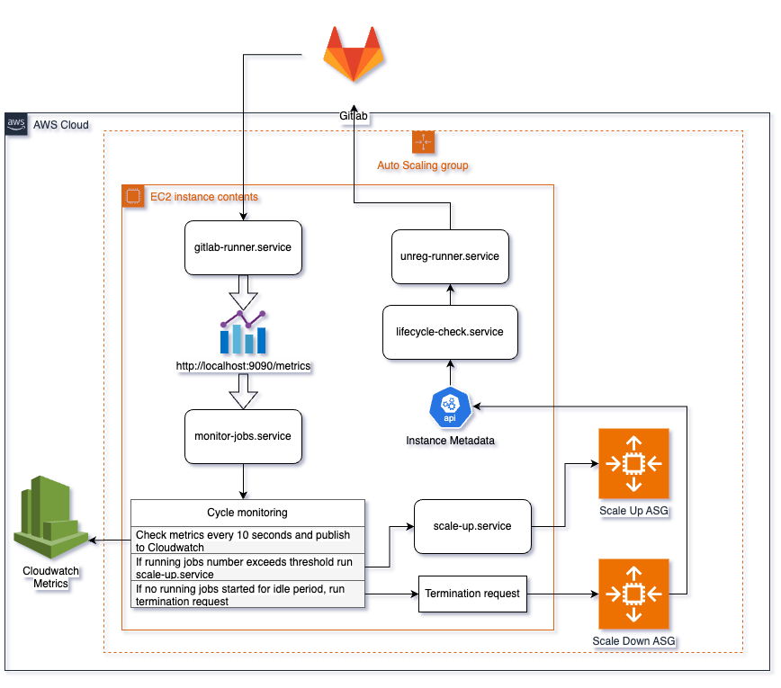

# Solution Overview

This document provides a detailed overview of the solution, including lifecycle hooks, services, and their interactions within the system. 

---

## Lifecycle Hooks and Ansible Playbooks

Two Ansible playbooks manage the lifecycle of GitLab Runner instances:

1. **`gitlab_runner_init.yml`**:
   - Triggered when an EC2 instance starts.
   - Registers new runner instances in GitLab.
   - Obtains runner registration tokens and updates the `gitlab-runner` configuration with new keys.
   - Starts the `gitlab-runner` service before completing the EC2 lifecycle hook.

2. **`gitlab_runner_unreg.yml`**:
   - Triggered during instance termination.
   - Gracefully stops the `gitlab-runner` service.
   - Unregisters the runner instances from the GitLab server.
   - Completes the EC2 lifecycle hook, allowing instance termination to proceed.

---

## Services Interaction Diagram

Below is a schema illustrating the interaction between various services. It provides a visual representation of how lifecycle hooks and systemd services work together to manage GitLab Runner instances and scaling processes.

---

## Main Systemd Services

The following systemd services manage the GitLab Runner lifecycle, scaling, and monitoring processes:

### 1. **`gitlab-runner.service`**
   - **Description**: The primary service for GitLab Runner instances.
   - **Functionality**:
     - Executes GitLab jobs.
     - Exposes Prometheus metrics at `http://localhost:9090/metrics` for monitoring.
   - **Role**: Core component of the system responsible for job execution.

---

### 2. **`monitor-jobs.service`**
   - **Description**: Continuously monitors GitLab Runner metrics and makes scaling decisions.
   - **Functionality**:
     - Polls the Prometheus metrics endpoint (`http://localhost:9090/metrics`) every 10 seconds.
     - Tracks the number of running jobs and compares it to the concurrency limit.
     - **Scaling Logic**:
       - If the number of running jobs reaches the concurrency limit, triggers the `scale-up.service`.
       - If no jobs are detected for a specified idle threshold, sends a termination request to the Auto Scaling Group to reduce capacity.
   - **Role**: Ensures optimal scaling of instances based on job load.

---

### 3. **`scale-up.service`**
   - **Description**: Manages scaling up of the Auto Scaling Group.
   - **Functionality**:
     - Executes the `scale_up.yml` Ansible playbook to increase the desired capacity by one.
     - Waits until the number of running jobs falls below the concurrency limit.
   - **Role**: Dynamically adjusts capacity to handle increased job demand.

---

### 4. **`lifecycle-check.service`**
   - **Description**: Detects EC2 instance lifecycle state changes and spot instance interruptions.
   - **Functionality**:
     - Polls EC2 instance metadata to monitor for:
       - Target lifecycle state changes.
       - Spot instance interruption notices.
     - On detection of a relevant notification, completes with success and triggers the `unreg-runner.service`.
   - **Role**: Ensures proper handling of instance termination events.

---

### 5. **`unreg-runner.service`**
   - **Description**: Handles the unregistration of GitLab Runner instances during termination.
   - **Functionality**:
     - Triggered by `OnSuccess` from `lifecycle-check.service`.
     - Executes the `gitlab_runner_unreg.yml` Ansible playbook to:
       - Unregister the GitLab Runner instances.
       - Complete the EC2 lifecycle hook, allowing the Auto Scaling Group to terminate the instance.
   - **Role**: Ensures graceful termination of runner instances and proper deregistration from GitLab.

---

## Summary

This solution combines lifecycle hooks, Ansible playbooks, and systemd services to provide a robust and automated system for managing GitLab Runner instances. The key components work together to:
- Register and unregister runners dynamically.
- Monitor job metrics and make scaling decisions.
- Gracefully handle instance lifecycle events to optimize performance and resource utilization.
